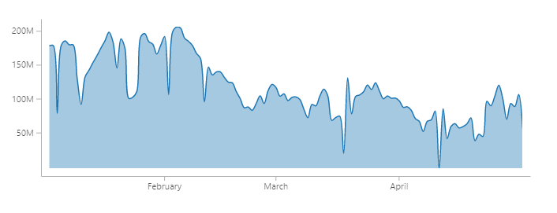

<p align="center">

<p style="font-size:.7rem" align="center">This is an example line graph made with d3-lit. The code is below.</p>
</p>

### Motivation

The parts of D3 that are meant to directly produce DOM elements are hard to use with frameworks, because manual work is needed to correctly react to changes. Avoiding this is one of the reasons why frontend frameworks exist in the first place, so this feels like a step back for some people.

You can of course use things like d3-axis with frontend frameworks like Preact, but it's not that pretty: you have to use ref callbacks (see [Mike Bostock's post for an example](https://medium.com/@mbostock/why-you-should-use-d3-ae63c276e958)). In Vue.js, ref callbacks don't even exist. Many visualization libraries, e.g. [vx](https://github.com/hshoff/vx), implement things like axes from scratch, because it's easier that way.

Web Components allow us to build components that react to changes and are both usable in vanilla JavaScript and modern frameworks.

### Usage

This is obviously experimental and not meant to be used in a "serious" environment.

Refer to [the LitElement usage guide](https://lit-element.polymer-project.org/guide/use) for a guide on how to use the components.

The API is nearly the same as [D3's API](https://github.com/d3/d3-axis):

```html
<body>
  <d3-axis></d3-axis>
</body>
<script>
  const axis = document.querySelector('d3-axis')
  axis.tickSizeInner = 12
  console.log(axis.tickSizeInner) // 12
</script>
```

For a simple Line Graph, you can either proceed like in the example above or use it inside of another LitElement component:

```jsx
<line-graph
  width="700"
  height="250"
  .data=${users.map(entry => ({
    date: new Date(entry.date),
    value: entry.value
  }))}
  .yScale=${{ minValue: 0 }}
  brush
  area
  .xAccessor=${x => x.date}
  .yAccessor=${x => x.value}
  .curve=${d3.curveCatmullRom}
/>
```
